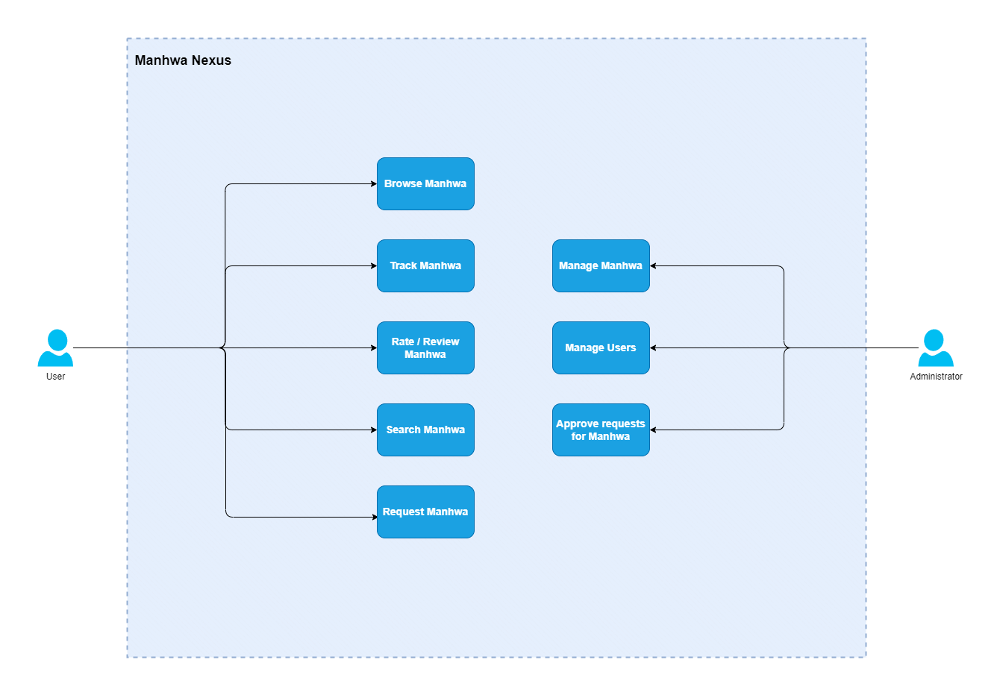
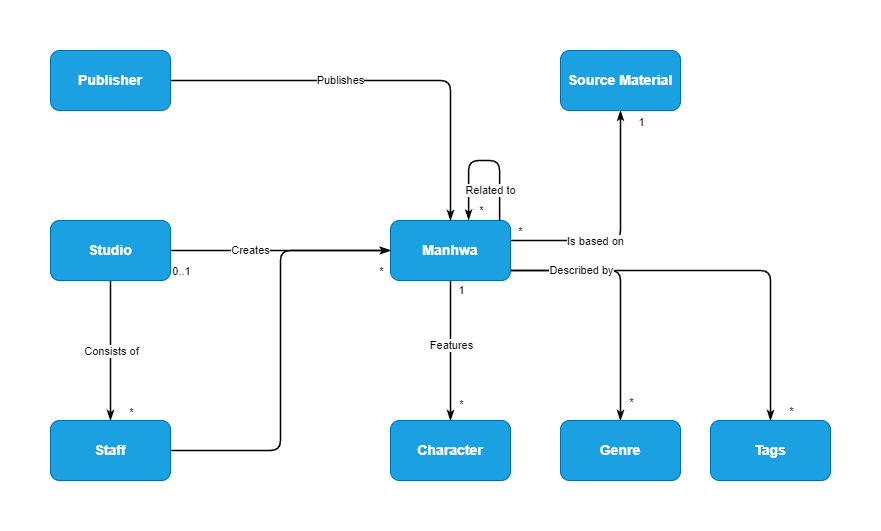

# Manhwa Nexus

The goal of Manhwa Nexus is to provide users a central portal for all things related to Manhwa.

## Development Environment

### Requirements

- Java 17
- Node 16+
- NPM 8+

### Build server jar

To build server jar run the following command at project root:

```cli
$ ./gradlew distribute
```

The server jar will be located in the <PROJECT_ROOT>/build/distributions folder

### Run server

- Build server jar
- Navigate to <PROJECT_ROOT>/build/distributions
- Run:

```cli
$ java -jar manhwa-nexus-server-<VERSION>-SNAPSHOT-all.jar
```

### Generate Jooq classes

The repositories in manhwa-nexus-data-access depend on Jooq auto-generated classes and should be generated before
development. <br>

The generator is configured with the jooq-config.xml, which is not kept in the repository since it has senstitive data.
- Rename "jooq-config-example.xml" to "jooq-config.xml"
- Enter db credentials (user and password) in the jdbc section
- Configure "directory" to be <PATH_TO_PROJECT_ROOT>/manhwa-nexus-data-access/src/main/java

To generate the classes run:

```cli
$ ./gradlew manhwa-nexus-data-access:codegen
```

This is only be required before development. When building the server jar, the <code>codegen</code> task is executed
during the <code>distribute</code> task

## Analysis

The following is mostly just exploratory analysis to get an understanding over the domain and what features Manhwa Nexus
should have.

### Use cases



### Domain entities

