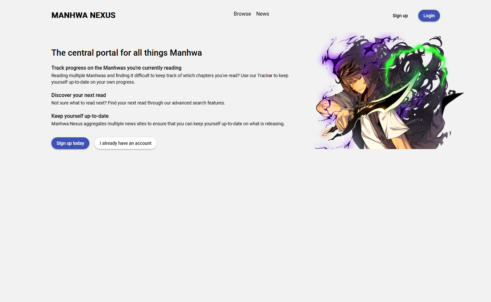

# Manhwa Nexus

The goal of Manhwa Nexus is to provide users a central portal for all things related to Manhwa.




## Development Environment

### Requirements

-   Java 17
-   Node 16+
-   NPM 8+

### Build server jar

To build server jar run the following command at project root:

```console
$ ./gradlew build
```

The server jar will be located in the <PROJECT_ROOT>/build/distributions folder

### Run server

-   Build server jar
-   Run:

```console
$ java --add-opens java.base/java.time=ALL-UNNAMED -jar ./build/distributions/manhwa-nexus-server-<VERSION>-SNAPSHOT.jar

or 

$ bash ./build/distributions/run.sh
```

## Analysis

The following is mostly just exploratory analysis to get an understanding over the domain and what features Manhwa Nexus
should have.

### Use cases


### Domain entities


### News updates concept


